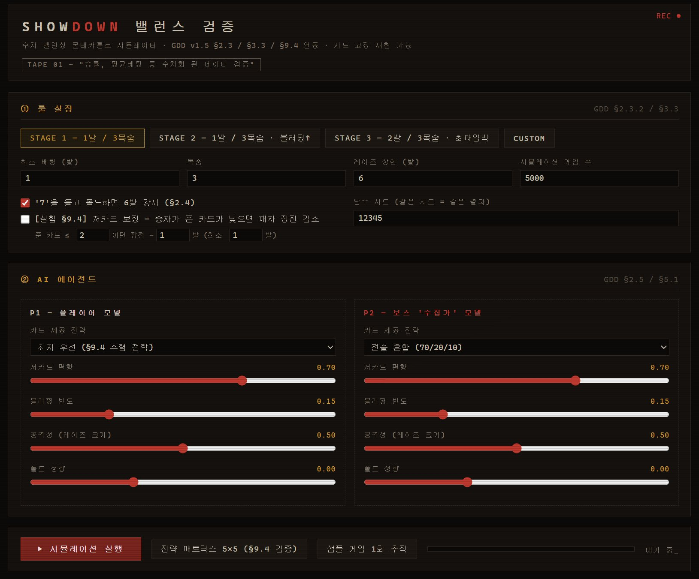
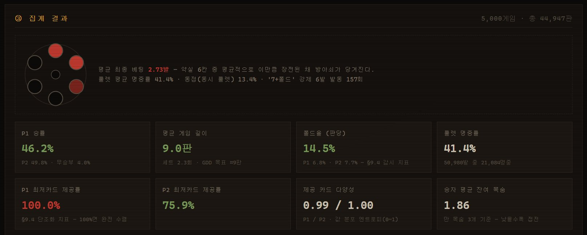
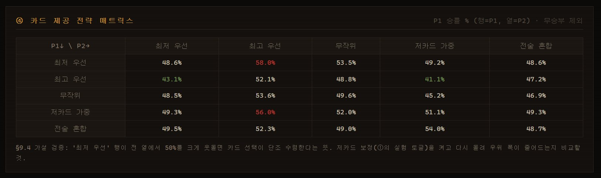
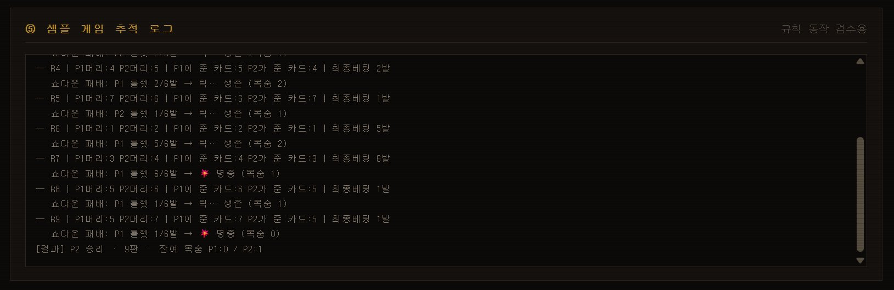

# SHOWDOWN — 밸런스 시뮬레이터

> **ShowDown** 개발용 별도 리포지토리입니다.  
> GDD v1.5 §2 규칙을 그대로 구현한 몬테카를로 시뮬레이터로, 플레이테스트 전 수치를 사전 검증합니다.

<br><br>

## 파일

```
showdown-balance/
├── README.md               # 지금 보고 있는 README 문서
└── docs/
    ├── index.html          # 브라우저에서 바로 실행되는 단일 파일 시뮬레이터
    └── screenshots/
        ├── 01_config.png   # 룰 설정 · AI 에이전트 패널
        ├── 02_result.png   # 집계 결과 · 진단 카드
        ├── 03_matrix.png   # 전략 매트릭스 5×5
        └── 04_trace.png    # 샘플 게임 추적 로그
```


<br><br>

## 용어 설명

### 카드 제공 전략
1. 최저 우선: 항상 가장 낮은 숫자를 상대에게 줍니다.
2. 최고 우선: 항상 가장 높은 숫자를 상대에게 줍니다.
3. 무작위: 손패에서 완전히 랜덤으로 한장 선택해서 상대에게 줍니다.
4. 저카드 가중: 낮은 카드에 높은 확률 가중치를 주되, 완전 수렴은 아니고 편향 수치로 얼마나 최저 우선에 가까운지 조절합니다.
5. 전술 혼합 (70/20/10): 70% 확률로 최저 카드, 20%로 중간, 10%로 최고를 상대에게 줍니다.

### 에이전트 파라미터
1. 저카드 편향: "저카드 가중" 전략을 선택했을 때만 실질적으로 의미가 있습니다. 0~1 사이 값으로, 1에 가까울수록 최저 우선과 동일하게 수렴하고, 0에 가까울수록 무작위에 가까워집니다. 예를 들어 0.7이면 손패에서 가장 낮은 카드를 줄 확률이 꽤 높지만 가끔은 두 번째, 세 번째 낮은 카드도 나옵니다.
2. 블러핑 빈도: 실제 카드 추론상 확신이 낮은데도 큰 레이즈를 선언하는 확률. 0.15면 15% 확률로 근거 없는 고액 레이즈를 던집니다. AI를 강하게 설정하려면 이걸 높이면 되고, 정직한 플레이어를 모델링하려면 낮추면 됩니다.
3. 공격성: 확신이 있을 때 레이즈를 얼마나 크게 올리는가. 0에 가까우면 확신이 있어도 1~2발씩만 조심스럽게 올리고, 1에 가까우면 확신이 있으면 한 번에 최대까지 올립니다.
4. 폴드 성향: 양수면 폴드를 더 잘 하는 소심한 플레이어, 음수면 웬만하면 콜을 강행하는 플레이어 입니다.

<br><br>

## 스크린샷

### 룰 설정 · AI 에이전트



스테이지 프리셋 버튼으로 GDD §3.3 수치를 원클릭 적용합니다.  
P1(플레이어 모델)과 P2(보스 '수집가' 모델)를 독립적으로 설정합니다.

| 항목 | 설명 |
|---|---|
| 최소 베팅 / 목숨 | 스테이지별 압박 곡선 기준값 |
| 레이즈 상한 | 가변 레이즈(§2.3.3) 최대 발수 |
| '7'+폴드 6발 강제 | §2.4 예외 규칙 on/off |
| 저카드 보정 토글 | §9.4 해법 후보 실험용 |
| 난수 시드 | 같은 시드 = 완전 동일 결과 재현 |

<br>

### 집계 결과



**Stage 1 기본 설정 (1발 / 3목숨 / 레이즈 상한 6) — 5,000 게임 결과**

| 지표 | 값 | 비고 |
|---|---|---|
| P1 승률 | **46.2%** | P2(보스 전술혼합) 49.8% · 무승부 4.0% |
| 평균 게임 길이 | **9.0판** | GDD 목표 ≈9판 |
| 폴드율 (판당) | **14.5%** | P1 6.8% · P2 7.7% |
| 룰렛 명중률 | **41.4%** | 50,980발 중 21,084명중 |
| P1 최저카드 제공률 | **100.0%** | §9.4 단조화 수렴 확인 |
| P2 최저카드 제공률 | **75.9%** | 전술혼합 전략 반영 |
| 제공 카드 다양성 | **0.99 / 1.00** | P1/P2 엔트로피 (0~1) |
| 승자 평균 잔여 목숨 | **1.86** | 3목숨 기준 접전 수준 |
| 평균 최종 베팅 | **2.73발** | 약실 6칸 기준 |
| 동점(동시 룰렛) | **13.4%** | |
| '7+폴드' 강제 6발 발동 | **157회** | |

<br>

### 전략 매트릭스 5×5



**행 = P1 전략 / 열 = P2 전략 / 표시값 = P1 승률 (무승부 제외)**

|  | 최저 우선 | 최고 우선 | 무작위 | 저카드 가중 | 전술 혼합 |
|---|---|---|---|---|---|
| **최저 우선** | 48.6% | 🔴 58.0% | 53.5% | 49.2% | 48.6% |
| **최고 우선** | 🟢 43.1% | 52.1% | 48.8% | 🟢 41.1% | 47.2% |
| **무작위** | 48.5% | 53.6% | 49.6% | 45.2% | 46.9% |
| **저카드 가중** | 49.3% | 🔴 56.0% | 52.0% | 51.1% | 49.3% |
| **전술 혼합** | 49.5% | 52.3% | 49.0% | 54.0% | 48.7% |

**§9.4 가설 검증 결과**

> GDD §9.4는 "'가장 낮은 카드부터 주기'가 압도적 정답이 되어 카드 선택이 기계적으로 수렴한다"고 기록했다.

매트릭스 결과, **'최저 우선' 행이 전 열에서 50%를 크게 웃돌지는 않는다** (최고: 58.0%, 최저: 48.6%).  
'최저 우선' 자체의 절대 우위보다 **상대가 '최고 우선'일 때 유독 유리한 구조** 가 더 두드러진다.

- '최저 우선' vs '최고 우선' = 58.0% — 이 조합이 최대 격차
- '최고 우선'은 모든 상대에게 전반적으로 불리 (41~52%)
- '전술 혼합'과 '저카드 가중'은 상대방에 따라 수렴 없이 분산

**→ P1 제공 카드 다양성(엔트로피)은 1.00이지만 실제 선택은 최저에 100% 수렴.** 이는 §9.4가 지적한 현상 그대로이며, '전술 혼합' 전략(보스 모델)을 적용해도 단조화를 완전히 막지는 못한다.

<br>

### 샘플 게임 추적 로그



규칙 동작 검수용 1회 추적 로그입니다. 판마다 머리 카드·제공 카드·최종 베팅·룰렛 결과를 출력합니다.

위 로그 예시 (R4~R9):

```
─ R5 | P1머리:7 P2머리:6 | P1이 준 카드:6  P2가 준 카드:7 | 최종베팅 1발
   쇼다운 패배: P2 룰렛 1/6발 → 틱… 생존 (목숨 1)
─ R7 | P1머리:3 P2머리:4 | P1이 준 카드:4  P2가 준 카드:3 | 최종베팅 6발
   쇼다운 패배: P1 룰렛 6/6발 → 💥 명중 (목숨 1)
─ R9 | P1머리:5 P2머리:7 | P1이 준 카드:7  P2가 준 카드:5 | 최종베팅 1발
   쇼다운 패배: P1 룰렛 1/6발 → 💥 명중 (목숨 0)
[결과] P2 승리 · 9판 · 잔여 목숨 P1:0 / P2:1
```

<br><br>

## 사용법

1. 스테이지 프리셋 선택 (Stage 1 / 2 / 3) 또는 Custom으로 수동 조정
2. P1 · P2 에이전트 전략 · 슬라이더 설정
3. **▶ 시뮬레이션 실행** — 5,000 게임 기준 약 2~3초
4. **전략 매트릭스 5×5** — §9.4 단조화 가설 수치 검증
5. **샘플 게임 1회 추적** — 규칙 동작 이상 없는지 판별

> **난수 시드를 고정**하면 설정이 같을 때 항상 동일한 결과가 나옵니다. 수치 비교 실험 시 시드를 그대로 두고 파라미터만 바꿔 비교하세요.

<br><br>

## 구현된 룰

- 덱 1~7 × 2장 = 14장 / 손패 5장 / 미사용 4장
- 각자 손패에서 한 장을 골라 **상대** 머리 위에 부착 (내 머리는 상대가 결정)
- 베팅: 최소 베팅으로 시작 → 가변 레이즈(최종 베팅 1~6발 지정, §2.3.3)
- 패자 또는 폴드한 쪽이 자기가 건 총알 수만큼 장전 후 룰렛
- **동점** → 양쪽 동시 룰렛 (§2.1.3)
- **'7' + 폴드** → 베팅 무관 6발 강제 (§2.4)
- AI 판단: 정보 비대칭 그대로 — 상대 머리(내가 준 카드)는 알고, 내 머리는 "덱 − 내 원래 손패 − 공개된 과거 내 머리 카드"로 확률 추론

<br><br>

## 향후 실측 연계 포인트

| 검증 항목 | 시뮬레이터 지표 | 실측 확인 방법 |
|---|---|---|
| §9.4 단조화 실제 문제 여부 | P1 최저카드 제공률 100% 재현 | 플레이어가 실제로 항상 최저를 주는지 관찰 |
| §9.4 폴드 동기 약함 | 폴드율 14.5% (시뮬) | 실측 폴드 빈도와 비교 |
| 게임 길이 목표 달성 | Stage 1 ≈ 9판 | 실제 플레이 소요 시간·판 수 기록 |
| 저카드 보정 효과 | 보정 ON/OFF 승률·길이 비교 | 보정 룰 추가 후 체감 단조화 변화 수집 |

<br><br>

## 관련 링크

- [본 개발 리포지토리]("https://github.com/jjinzxx/showdown")
- GDD v1.5 — (팀 내부 문서)

<br><br>

*Team 김이박임*
